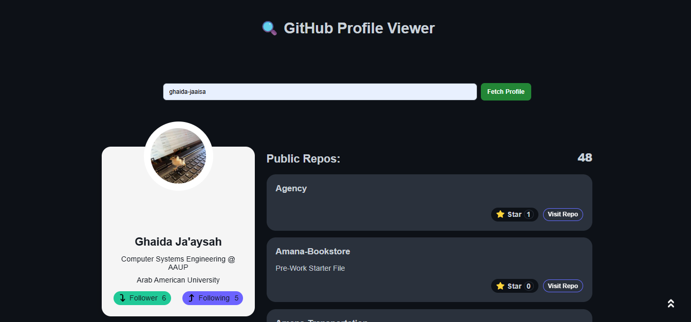

# 🔍 GitHub Profile Viewer

A simple and elegant web application that allows you to **view any GitHub user’s profile** through a clean and responsive interface.  
The app fetches data from the GitHub REST API and displays user details such as avatar, bio, company, followers, and public repositories.

---

## 🚀 Features

### 👤 User Profile Card
- Avatar  
- Name & Username  
- Bio  
- Company  
- Location  
- Followers & Following  

### 📦 Public Repositories
For each repository:
- Repository name  
- Description  
- Stars count ⭐  
- Button to visit the repo on GitHub  

### ⚡ Skeleton Loading
Shows skeleton UI while repositories load.

### 📌 Auto Load Last Search
The last fetched user is saved in `localStorage` and displayed automatically when the page is reopened.

### 🔝 Scroll-to-top Button
Smooth animated button to return to the top of the page.

---

## 🛠 Technologies Used

- **HTML5**
- **CSS3** (responsive design, skeleton UI, animations)
- **JavaScript (Vanilla)**  
  - Fetch API  
  - DOM manipulation  
  - LocalStorage  
- **GitHub REST API**

---


No server required — works directly in the browser.

---

## 🧠 How It Works

### 1️⃣ Fetching User Data
- Sends request to:  
  `https://api.github.com/users/{username}`
- If the user exists → renders the profile card.

### 2️⃣ Fetching Repositories
- Uses `repos_url` to fetch user repositories.
- Displays skeleton loaders.
- Creates dynamic repo cards after data is loaded.

### 3️⃣ Saving Last Search

```js
localStorage.setItem("latestRequest", JSON.stringify(data));
```
Loads the saved user on page refresh.


Made with Love 
```
Ghaida Ja'aysah ❤
```